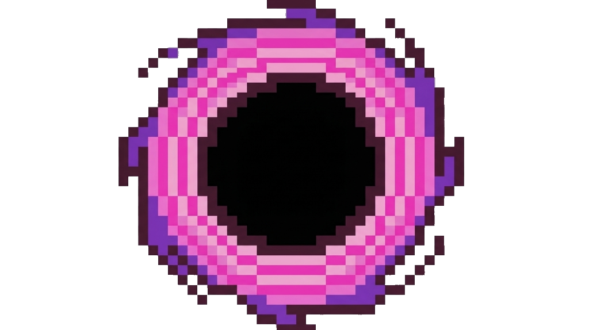

# ⚡ DustFX - Ultimate Gaming Visual Enhancer & Filter Engine

<p align="center">
  
</p>

<p align="center">
  <b>Ultra-fast, hardware-accelerated screen visual filter engine designed for competitive gaming.</b><br>
  Real-time DCCW Gamma Boost, Digital Vibrance, RGB Tone Adjustment, and Global Background Hotkeys.
</p>

<p align="center">
  
  
  
  
</p>

---

## 🌟 Features

- 🌙 **DCCW Gamma Boost (Night Vision)**: Instantly boost shadow visibility in dark environments (e.g. Rust nights, caves) with smooth exponent curves.
- 🎨 **Digital Vibrance (Saturation Matrix)**: Increase color saturation for enhanced enemy visibility and vibrant game visuals.
- 🎯 **One-Click MAX DCCW**: Dedicated hotkey to toggle Maximum Gamma instantly without altering your custom vibrance or brightness levels.
- ⌨️ **Global Background Hotkeys**: Dynamically assign key bindings (e.g., `F8`, `F9`, or custom keys) that trigger instantly while in-game.
- 🛡️ **100% Anti-Cheat Safe (0% Ban Risk)**: Built on the official Windows Magnification Fullscreen Color Matrix Engine (`magnification.dll`). Does **NOT** inject DLLs, read/write game RAM, or tamper with game files.
- 🔕 **System Tray Minimization**: Hides seamlessly to the notification area with a custom dark-mode context menu.
- ⚙️ **Persistent Configurations**: Saves user hotkeys and settings automatically (`dustfx_config.txt`).

---

## 🛡️ Anti-Cheat Compliance & Technical Operation

> [!IMPORTANT]
> **Anti-Cheat Status: 0% Ban Risk (Safe for EAC, BattlEye, Ricochet, Vanguard)**
>
> DustFX operates strictly at the Windows OS Display Matrix level via native `magnification.dll`. 
> 
> - **No Memory Tampering**: DustFX does not open process handles (`OpenProcess`), read memory (`ReadProcessMemory`), or write memory (`WriteProcessMemory`).
> - **No Code Injection**: DustFX does not inject DLLs or hook DirectX/OpenGL/Vulkan rendering pipelines inside game processes.
> - **OS Level Display Transformation**: Operating display color matrices is an officially supported feature of Microsoft Windows and GPU manufacturers (NVIDIA Control Panel / AMD Software).

---

## ⚖️ Legal Disclaimer & EULA

### 1. Terms of Use
By downloading, compiling, or using DustFX, you agree to the following terms and conditions.

### 2. "As Is" Warranty Disclaimer
DustFX is provided **"as is"**, without warranty of any kind, express or implied, including but not limited to the warranties of merchantability, fitness for a particular purpose, and non-infringement. In no event shall the authors or copyright holders be liable for any claim, damages, or other liability, whether in an action of contract, tort, or otherwise, arising from, out of, or in connection with the software or the use or other dealings in the software.

### 3. Fair Use & Game Compatibility
DustFX is an external desktop display utility. The user is responsible for ensuring compliance with the specific Terms of Service (ToS) and rules of any third-party multiplayer games or platforms they participate in. The developers of DustFX assume no liability for game suspensions, bans, or account actions resulting from third-party competitive rules.

---

## 🚀 Quick Start & Building

### Option 1: Download Release Binary
Download the pre-compiled standalone executable from the [GitHub Releases Page](https://github.com/Dust-exe/DustFX/releases).

### Option 2: Build from Source
DustFX can be compiled directly using the native Windows C# compiler (`csc.exe`) included in all Windows installations:

```cmd
git clone https://github.com/Dust-exe/DustFX.git
cd DustFX
build.bat
```

The script will compile `DustFX.cs` and generate `DustFX.exe` with the embedded pixel portal icon.

---

## 🎮 Default Hotkeys

| Hotkey | Action | Description |
| :--- | :--- | :--- |
| **`F8`** | **Max DCCW Toggle** | Toggles Maximum Gamma Boost (Night Vision) on/off |
| **`F9`** | **Vibrance Toggle** | Toggles Digital Vibrance Saturation on/off |

*Hotkeys can be customized directly in the application UI.*

---

## 📜 License

This project is licensed under the [MIT License](LICENSE).
